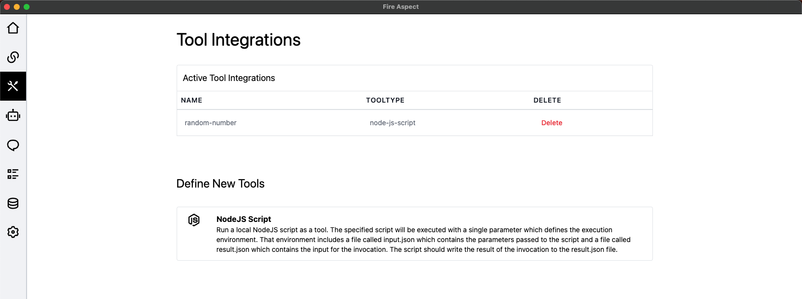

# Fire Aspect AI Desktop Framework

This is a desktop AI framework for the Fire Aspect AI project. It is a desktop application that allows you to build and chat with AI agents in a nice GUI. It is built using the Electron framework and uses its own custom AI engine.

## Setup

To setup the project, you need to have Node.js installed on your machine. You can download it from [here](https://nodejs.org/). Once you have Node.js installed, you can clone the repository and run the following commands:

```bash

git clone https://github.com/eric-aerrober/fire-aspect

cd fire-aspect

npm install

# to build the sqlite3 db
npm run drizzle

# to start the application
npm run start

# Add integrations with models and setup any tools you want to use through the UI, chat with the AI agents and have fun!
```

## Features


1. Provide your own API Keys for the AI model you want to use. The application supports the following APIS curently:

    - [Anthropic](https://www.anthropic.com/)
    - [AWS Bedrock](https://aws.amazon.com/bedrock/)


2. Chat directly with the AI agents and see the responses in real-time. 


3. Define custom tools and actions for the AI agents to use.



4. See full logs of the conversation with the AI agents including events and actions.


5. Local data stored in Sqlite3 database. No data is sent to the cloud other than API calls.


## Roadmap

Current Goals

- More AI Support (OpenAI)
- Image model support (DALL-E, StableDiffusion)
- Addition of useful built-in tools
- Browser extension for easy access to the AI agents from anywhere
- Longer running workflows
- Event driven workflows
- Ability for agents to escalate to human when stuck
- More complex execution of actions
- Agents invoking other agents
- Ability to define resources for agents to reference
- Cross conversation memory
- Vector based memory

- Unit testing (this will likely never happen haha)

## Contributing

If you would like to contribute to the project, please create a pull request with your changes. We will review the changes and merge them if they are good. If its something major, please DM me on discord or create an issue to discuss the changes.

## Community


We have a discord server where you can chat with other developers and ask questions about the project. You can join the server  [join here](https://discord.gg/VUccuG9Mgb)


